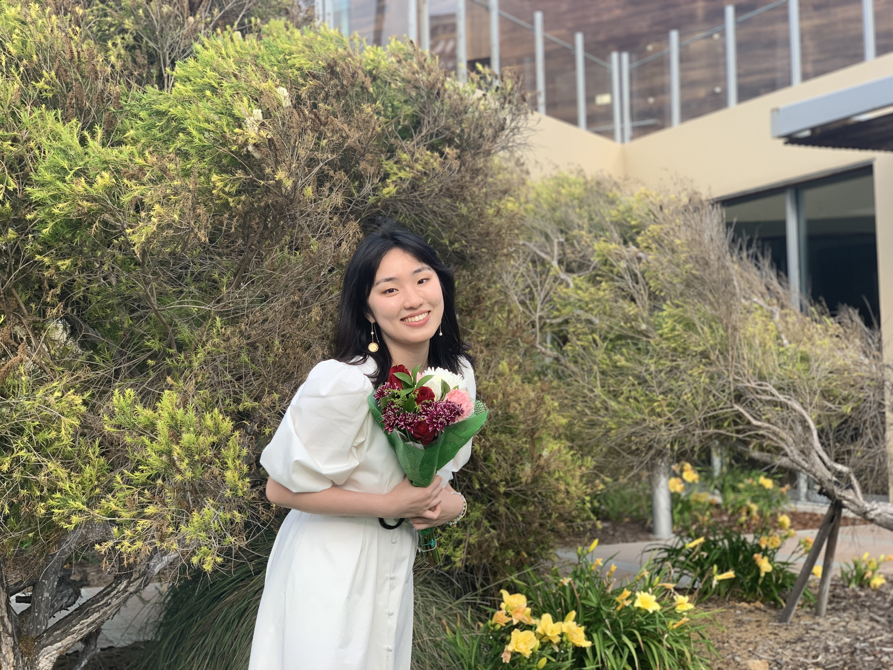

Hello! This is Shihui Zhu (祝诗慧). I am currently a MS student at Columbia University. 

My LinkedIn Page: 
[LinkedIn](https://www.linkedin.com/in/shihui-zhu-319266173/) and
[p8105](https://www.p8105.com)

What to know more about me? See [about](about.html) page.

# Education

*Columbia University, Mailman School of Public Health, New York, NY*

Expected May 2023

Master of Science in Biostatistics, Theory and Method Track

*University of California, San Diego*

Graduated June 2021

Jacob School of Engineering, San Diego, CA

Bachelor of Science in Bioengineering: Bioinformatics, and Math-Computer Science, GPA 3.7

*International Baccalaureate, Beijing, China*

Awarded June 2017

# Skills

* Machine learning algorithms via R, Python
* Simulations and Testing via R
* Other Computer Science Skills: Proficient C/C++ Programming

# Work Experience

Data Analyst, CUIMC 

*Fall 2021 - Now*

Running analytical models for public health dataset

# Projects

Improving Automated CLL/ALL diagnosis using Machine Learning, UCSD

*Senior Design, Summer 2020 – Summer 2021*

Construct automated analysis (data clustering) pipeline for Flow Cytometry data

* identifying quantitatively the diagnostic cell subtypes, learning visual patterns on UMAP
* Training the model via multiple machine learning and deep learning models, including
SVM, RM, LR, gradient descent, and CNN, performing classification on testing data.

More infor can be find [here](https://sites.google.com/ucsd.edu/group232021leukemiadiagnosis/home)

Bioinformatics Data Analysis, UCSD

*Research (Co-author), Winter 2019 – Summer 2021*

Exploring how differential translation elongation directs proteins synthesis in response to acute glucose deprivation in yeast using Python and R

# Awards

College Honor and Provost Honor at UCSD (x10 quarters)

# Research and Work Interests

Health Care Data Analysis, Biostatistics, 

Bioinformatics Participating in Columbia University’s Biostatistics Computing Club
